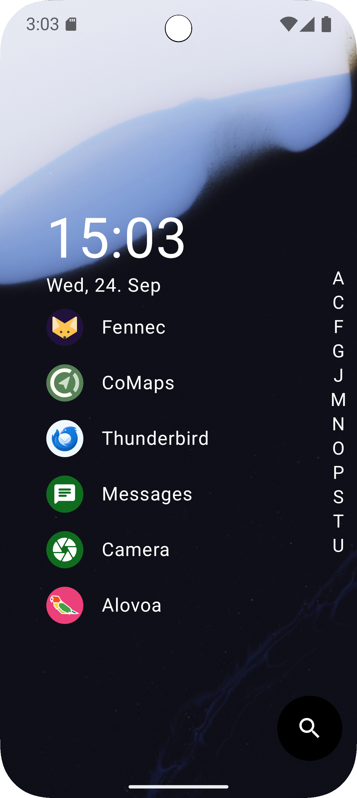
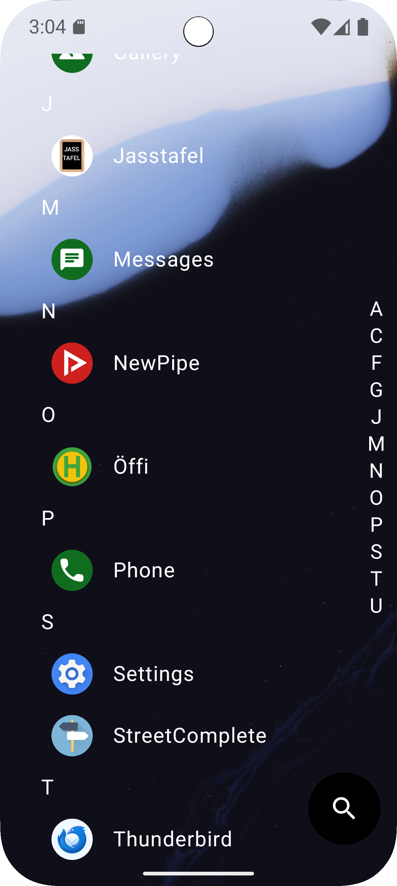
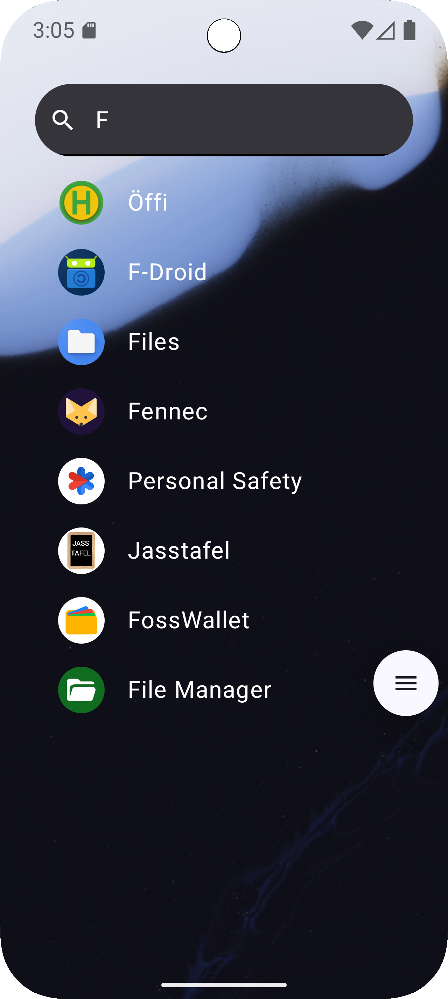
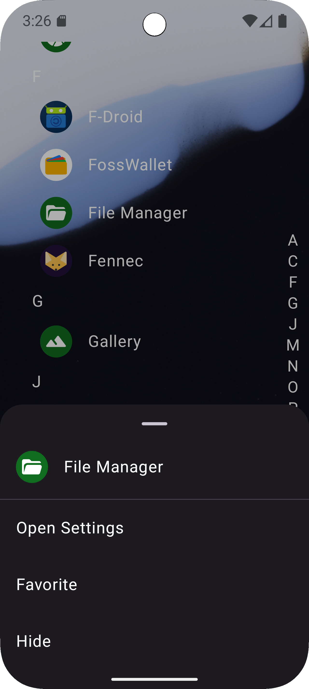

#  uIndex Launcher

> /ˈm(j)uːˈɪndɛks/

A minimalistic Android launcher that I coded because I was annoyed that niagara launcher has a pro subscription.

## Features

### Favorites Page
You can have all of your favorite apps on one page.

### App Drawer
If you want to find an app that is not in your favorites, just drag over the letters which act as 
the scroll bar on the right hand side to land in the app drawer.

### Search
If you'd rather type the name of your app, you can also tap on the search button to open the search bar where you can search through all your apps.

### App Menu
If you long press on an app, a menu pops up which gives you a few options related to the app, like:
- A button to open the apps Android settings
- A toggle to add/remove the app from the favorites.
- A toggle to hide/show the app from the app drawer.

## Installation
Download the apk from the [releases](https://github.com/einsjannis/uIndex/releases).

Then open the apk file on your device and click on install 
(You might need to add the app you used to download the APK as an app which can install other apps).

Then you can set in your phones settings uIndex as your home app or launcher.
